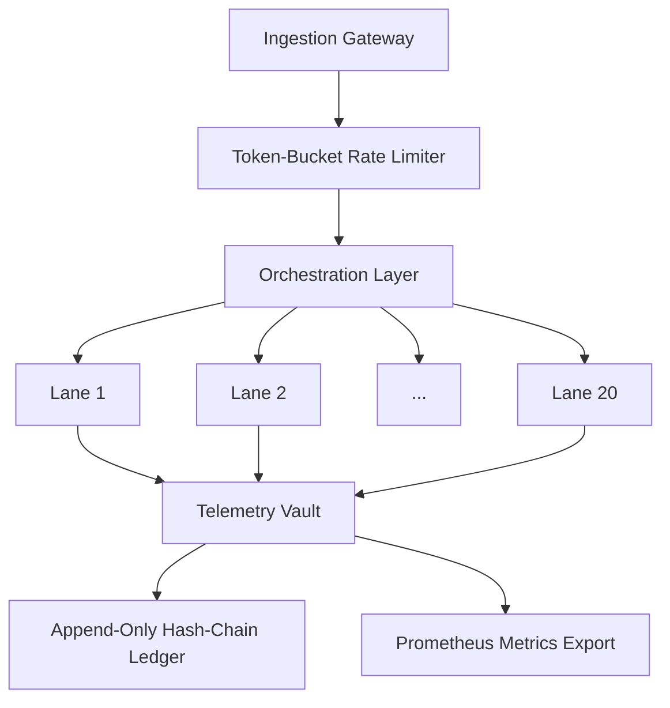

# Project Hyperion

### Enterprise-Grade Sandbox for High-Concurrency Asynchronous Stream Telemetry

**Status:** Bootstrapped · Self-Funded · Architecture Validated &nbsp;|&nbsp; **Target:** Cloud-Native Migration

---



**Project Hyperion** is a bootstrapped, advanced engineering framework designed to stress-test
the upper bounds of distributed asynchronous stream processing.  The architecture was
validated by routing high-throughput payloads through **20x parallel inference lanes**
(Claude Max equivalent) and **20x concurrent code-execution lines** (Codex equivalent)
simultaneously, saturating external commercial API channels at their maximum tier limits.

---

## Why Cloud Credits Are Critical

The architecture has successfully passed every local validation gate.  However, sustaining
this level of multi-lane concurrency against pay-as-you-go external APIs is financially
unsustainable for a bootstrapped entity.  **Cloud compute credits are required** to refactor
and re-platform these pipelines onto dedicated, scalable native cloud instances and
containerized worker nodes — eliminating the recurring external-API OpEx burden and
unlocking the architecture's full throughput potential.

---

## Quick Start

```bash
pip install -r requirements.txt
python3 core/orchestrator.py
```
