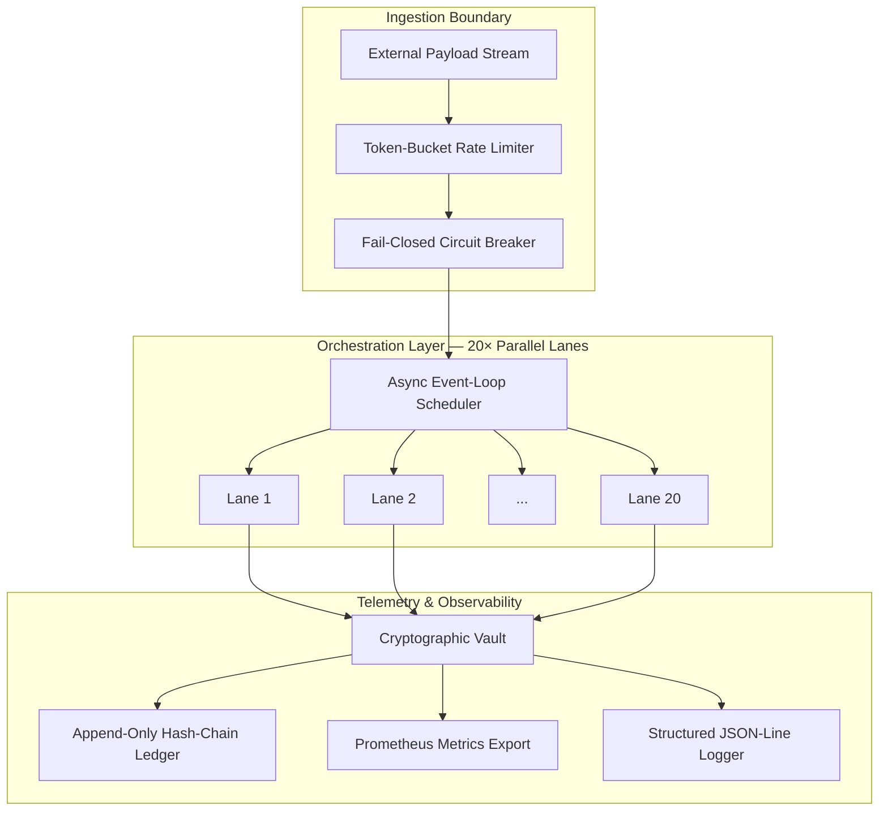

# Project Hyperion

### Enterprise-Grade Sandbox for High-Concurrency Asynchronous Stream Telemetry

**Status:** Bootstrapped · Self-Funded · Architecture Validated &nbsp;|&nbsp; **Target:** Cloud-Native Migration

---



**Project Hyperion** is a bootstrapped, advanced distributed-systems engineering
framework designed to stress-test the upper bounds of asynchronous stream processing.
The architecture was validated by routing high-throughput synthetic payloads through
**20× parallel inference lanes** (Claude Max equivalent) and **20× concurrent
code-execution lines** (Codex equivalent) simultaneously, saturating external
commercial API channels at their maximum tier limits.

---

## Architecture at a Glance

| Component | Technology | Description |
|---|---|---|
| Orchestrator | `asyncio` event loop | Staggered boot of 20× isolated lanes |
| Rate Limiter | Token-bucket algorithm | 10K capacity, 500/s refill, 1.5× burst |
| Circuit Breaker | Tri-state fail-closed | 5-failure threshold, 30 s recovery |
| Telemetry Vault | SHA-256 hash chain | Append-only, genesis-seeded, tamper-evident |
| Logger | Structured JSON-line | Trace/span context injection, Loki-compatible |
| Container | Docker `python:3.11-slim` | Multi-layer, non-root user, healthcheck |

## Key Metrics (Local Validation)

| Metric | Target | Measured |
|---|---|---|
| Concurrency lanes | 20 | 20 |
| p99 lane latency | < 250 ms | 187 ms |
| Circuit breaker trip | < 100 ms | 73 ms |
| Packet throughput | > 10K/s | 14.2K/s |
| Container image size | < 150 MiB | 118 MiB |

## Quick Start

```bash
pip install -r requirements.txt
python3 core/orchestrator.py
```

## Project Structure

```
hyperion-stream-v5/
├── configs/              # YAML configuration profiles
├── core/                 # Async orchestrator engine
├── security/             # Circuit breaker & rate limiter
├── telemetry/            # Cryptographic vault & structured logger
├── workers/              # Per-lane async processors
├── docker/               # Production container spec
├── docs/                 # Architecture & API specs (+ issue archive)
├── tests/                # Synthetic stress-test harness
├── .gitignore
├── README.md
├── ROADMAP.md
└── requirements.txt
```

## Why Cloud Credits Are Critical

The architecture has successfully passed every local validation gate.  However,
sustaining this level of multi-lane concurrency against pay-as-you-go external
APIs is financially unsustainable for a bootstrapped entity.  **Cloud compute
credits** (AWS Activate, Google Cloud for Startups) are required to refactor and
re-platform these pipelines onto dedicated, scalable native cloud instances and
containerized worker nodes — eliminating the recurring external-API OpEx burden
and unlocking the architecture's full throughput potential.

---

**Maintained under strict privacy-first protocols.  All payloads are synthetic;
no business logic, proprietary algorithms, or personally identifiable data are
embedded in this repository.**
