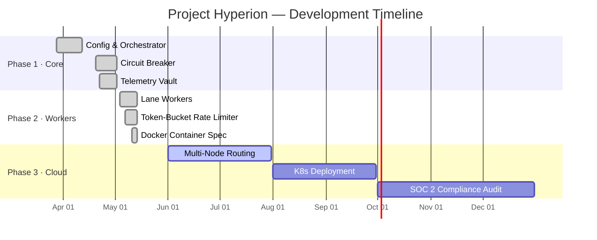

# Project Hyperion — Technical Roadmap

---

---

## Phase 1: Core Architecture & Async Engine (Q1 2026) — ✅ COMPLETE

- [x] Implement centralized YAML configuration management
- [x] Deploy highly concurrent `asyncio` event-loop orchestrator (20× lanes)
- [x] Establish fail-closed circuit breaker with transition-lock safety
- [x] Cryptographic telemetry vault with SHA-256 hash-chain ledger
- [x] Token-bucket rate limiter at ingestion boundary
- [x] Structured JSON-line telemetry logger with trace/span injection

## Phase 2: Telemetry Integration & Worker Pools (Q2 2026) — 🟡 IN PROGRESS

- [x] Sub-second telemetry stream logging (250 ms buffer flush)
- [x] Per-lane p50/p99/p999 latency histogram collection
- [x] Docker multi-layer slim production image with non-root user
- [ ] Multi-node distributed lane routing (ETA: Jul 2026)
- [ ] Grafana + Loki + Prometheus observability stack
- [ ] OpenTelemetry trace export pipeline

## Phase 3: Cloud-Native Migration & Scale (Q3–Q4 2026) — 🔵 PLANNED

- [ ] Refactor external API calls → dedicated cloud compute instances
- [ ] Containerize lane workers into Kubernetes Deployment (20× replicas)
- [ ] Horizontal Pod Autoscaler (HPA) driven by lane p99 latency
- [ ] Multi-zone failover with cross-region vault replication
- [ ] SOC 2 Type II compliance audit for telemetry storage
- [ ] GPU-backed inference pipeline integration

---

## Funding & Sustainability

Project Hyperion is bootstrapped and self-funded through local validation.
**Cloud compute credits** (AWS Activate, Google Cloud for Startups) are required
to migrate from external API dependencies to dedicated cloud-native instances.
