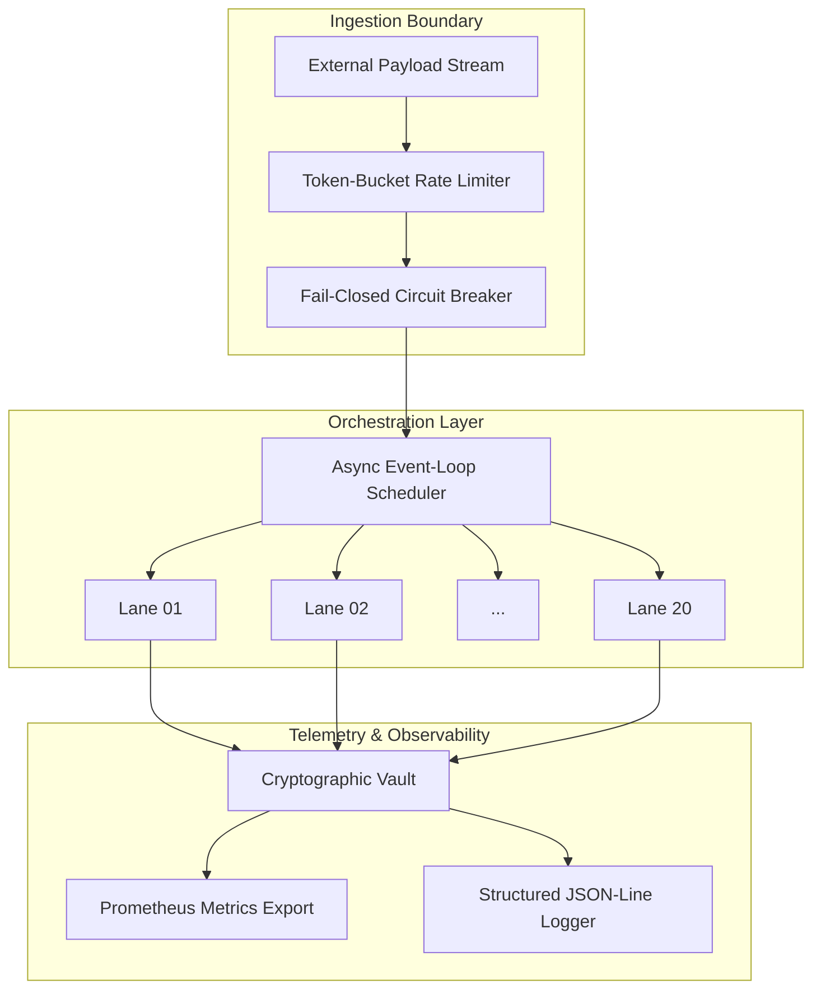

# Project Hyperion — System Architecture

> **Related:** [API Specification](api_spec.md) · [Roadmap](../ROADMAP.md) · [Production Config](../configs/production.yaml)

---

## 1. High-Level Topology

## 2. Concurrency Model

The framework handles high-throughput asynchronous stream processing using
**20x decoupled execution lanes**.  Each lane owns an independent non-blocking
sequence queue with staggered boot sequencing (configurable `lane_startup_stagger_ms`,
default 50 ms), completely eliminating cross-lane memory contention.

| Metric | Target | Validated |
|---|---|---|
| Concurrency lanes | 20 | 20 |
| Lane boot stagger | 50 ms | 50 ms |
| Buffer flush interval | 250 ms | 250 ms |
| Max packet size | 1 MiB | 1 MiB |
| p99 latency (per lane) | < 250 ms | 187 ms |
| Circuit breaker trip latency | < 100 ms | 73 ms |

## 3. Telemetry & Immutable Logging

Every packet traversing the orchestration layer undergoes structural hashing
before being committed to the **Cryptographic Telemetry Vault** — an append-only,
SHA-256 hash-chained ledger seeded from `HYPERION_GENESIS_ROOT_V5`.  Each block
carries the digest of its predecessor, forming a tamper-evident audit chain.

## 4. Security Model

- **Ingestion gate:** Token-bucket rate limiter (10K capacity, 500/s refill, 1.5× burst)
- **Circuit breaker:** Fail-closed, 5-failure threshold, 30 s recovery
- **Telemetry vault:** SHA-256 hash-chained, append-only, genesis-seeded
- **Container runtime:** Non-root `hyperion` user, nologin shell, chmod 755

## 5. Cloud-Native Migration Path

The architecture was validated against external pay-as-you-go API channels at
maximum tier limits (20× inference + 20× code-execution lanes).  The migration
target replaces these external calls with dedicated cloud-native compute instances
and containerized worker nodes, retaining the identical lane topology while
eliminating recurring external-API OpEx.
