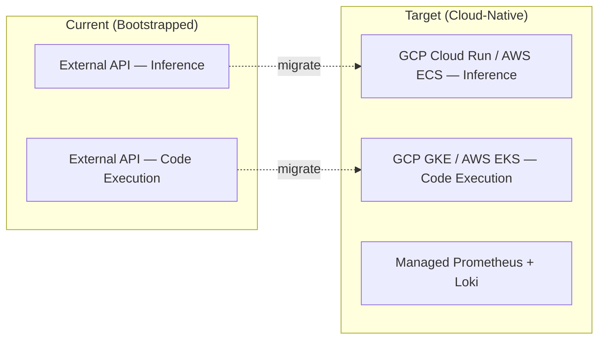

# Issue #008 — Cloud-Native Migration Architecture

**Reported:** 2026-05-22 10:00 &nbsp;|&nbsp; **Status:** Open &nbsp;|&nbsp; **Labels:** `infrastructure-scaling`, `cloud-migration`

## Summary
Design and document the migration path from external API-dependent lanes to
dedicated cloud-native compute instances.  The lane topology must remain
identical (20× inference + 20× code-execution); only the backing runtime
changes.

## Target Architecture

## Milestones
- [ ] Provision cloud compute credits (AWS Activate / GCP for Startups)
- [ ] Containerize lane workers into Kubernetes Deployments
- [ ] Replace external API calls with internal gRPC to cloud instances
- [ ] Validate p99 latency parity between external-API and cloud-native runs
- [ ] Decommission external API dependencies

## Funding Dependency
This migration cannot proceed without cloud compute credits.  External API
OpEx for 20× concurrent lanes is financially unsustainable for a bootstrapped
entity.
